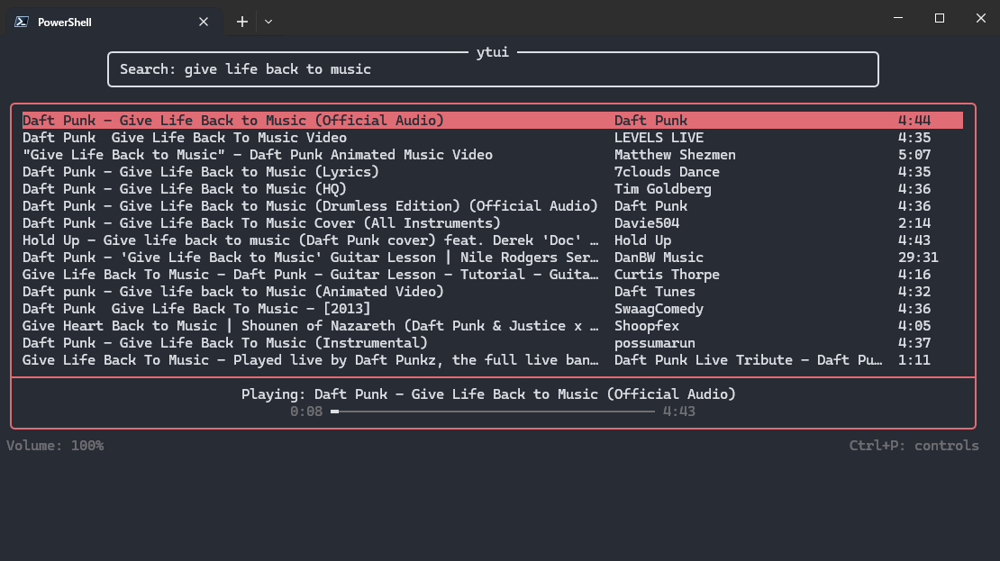

# ytui

A Windows terminal UI for searching, playing, and downloading YouTube audio.



## Prerequisites

- uv
- yt-dlp
- ffmpeg
- mpv

## Installation

```
git clone https://github.com/justinli34/ytui
cd ytui
uv build
uv tool install . --python 3.14
```

## Usage

```
ytui
```

## Known Issues

- Closing the terminal doesn't kill the mpv process.
